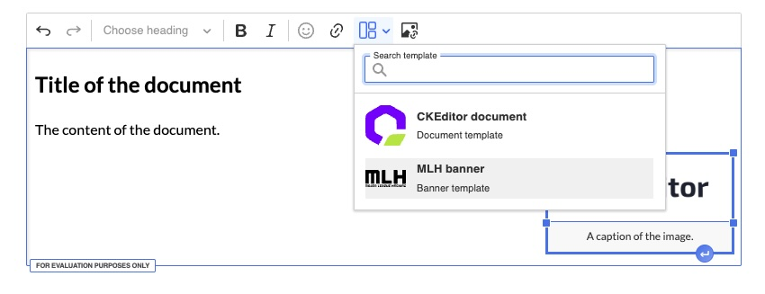
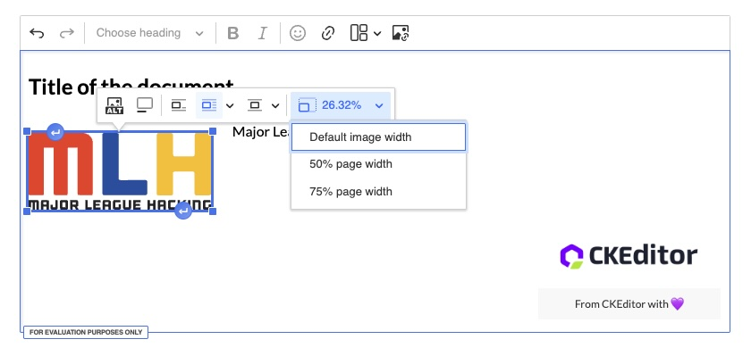
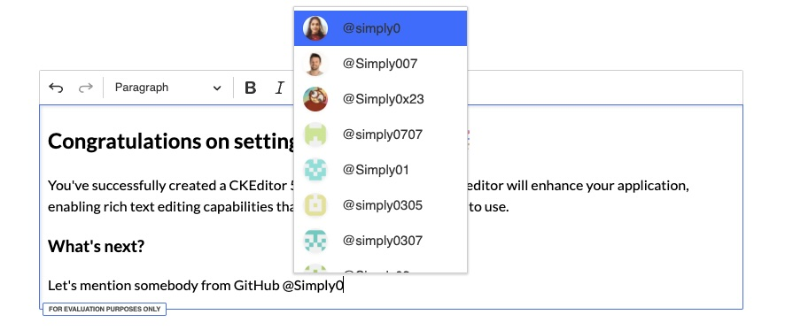
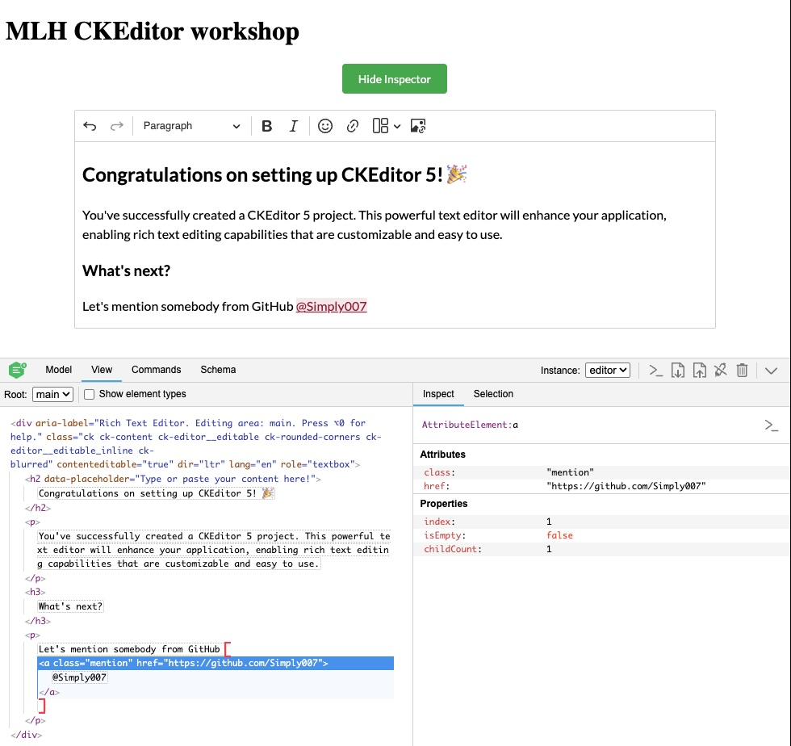

# CKEditor 5 MLH Global Hack Week August 2025 Sample Project

This repository is part of the CKEditor workshops and challenges organized for [MLH Global Hack Week: Beginners Week](https://ghw.mlh.io/events/beginners-week) ([CKEditor event info](https://ckeditor.com/blog/ckeditor-global-hack-week-aug-2025/)).  
See all CKEditor challenges:

- [Sign up for a CKEditor trial license key](https://www.mlh.com/challenges/019880db-050d-dc62-4577-7a6d1dcc319a)
- [Challenge 1: Use Builder to create a starter project](https://www.mlh.com/challenges/019880d2-95ea-c12c-1e5d-63759cb26748)
- [Challenge 2: Unleash the power of Typescript](https://www.mlh.com/challenges/019880db-4fb0-4ea6-34fd-9c019a302c9d)
- [Challenge 3: Add template functionality to CKEditor](https://www.mlh.com/challenges/019880e0-3380-0ee3-725f-ac94deb5606a)
- [Challenge 4: Hook CKInspector to the project](https://www.mlh.com/challenges/019880dc-cb00-8044-986b-9ce1f382de90)


## Getting Started

### 1. Install dependencies

To get started, install the necessary npm packages:

```sh
npm install
```

### 2. Set up environment variables

Create a `.env` file in the project root (you can copy `.env.template`):

```sh
cp .env.template .env
```

You need to provide:

- `VITE_CKEDITOR5_LICENSE_KEY` – CKEditor license key (see below)
- `VITE_GITHUB_TOKEN` – GitHub API token (see below)

### 3. Obtain required keys

#### CKEditor License Key

Sign up for a free trial at [CKEditor Portal](https://portal.ckeditor.com/signup?utm_campaign=devrel_ghw_hackathon_aug_2025&utm_source=mlh&utm_medium=referral&utm_term=resources).  
After registration, you will find your license key in the portal dashboard (valid for 14 days).

#### GitHub API Token

Follow [GitHub's documentation](https://docs.github.com/en/authentication/keeping-your-account-and-data-secure/managing-your-personal-access-tokens) to create a personal access token.  
Paste the token into your `.env` file.

### 4. Start the project

Run the following command to start the project:

```sh
npm run start
```

Open the project URL displayed in terminal in your browser. Remove the content of the CKEditor and start playing with the provided templates!

## CKEditor Workshops

### Workshop 1: Get started with CKEditor and explore its powerful editing environment

- Learn how to set up your development environment and familiarize yourself with the essential tools
- Get familiar with the editor's setup and plugin configurations  
- Transform the project from JavaScript to TypeScript

### Workshop 2: CKEditor development iteration showcase

- Dive deeper into CKEditor features
- Learn to configure plugins and customize the editor to meet your project's needs
- Explore the development tools you can use to boost your development and debugging efficiency

For a detailed walkthrough of the workshops scenario, see [SCRIPT.md](./SCRIPT.md).

## Features

### 1. Template, Heading, and Image Support

This project showcases advanced CKEditor features including:

- **Template Plugin**: Pre-defined document templates for quick content creation
  - CKEditor document template with styled headings and images
  - MLH banner template for event content
- **Heading Plugin**: Full heading hierarchy support (H1-H6) with custom styling
- **Image Plugin**: Comprehensive image handling with:
  - Image resizing options (50%, 75%, original)
  - Image captions and alternative text
  - Multiple image styles (inline, wrap text, break text)
  - URL-based image insertion

The template system allows users to quickly insert structured content, while the heading and image plugins provide rich formatting capabilities for creating professional documents.





### 2. Custom GitHub Mention Plugin

An enhanced mention plugin that integrates with the GitHub API to provide real-time user suggestions:

- **Dynamic User Search**: Search GitHub users by typing `@username`
- **GitHub API Integration**: Fetches user data from `https://api.github.com/search/users`
- **Rich User Display**: Shows GitHub avatars and usernames in mention dropdown
- **Smart Conversion**: Converts mentions to clickable GitHub profile links
- **Custom Rendering**: Enhanced UI with user avatars and styled mention items

The plugin demonstrates advanced CKEditor customization including:

- Custom upcast/downcast converters
- API integration for dynamic content
- Custom item rendering with GitHub avatars
- Automatic link generation to GitHub profiles





## Resources

- [CKEditor 5 Getting Started](https://ckeditor.com/docs/ckeditor5/latest/getting-started/index.html) – guides for all frameworks
- [CKEditor 5 Features](https://ckeditor.com/docs/ckeditor5/latest/features/index.html) – explore available plugins and features
- [CKEditor 5 Framework Deep Dive](https://ckeditor.com/docs/ckeditor5/latest/framework/index.html) – learn about the editor's architecture
- [CKEditor 5 Documentation](https://ckeditor.com/docs/)
- [CKEditor 5 Demos](https://ckeditor.com/ckeditor-5/demo/)
- [CKEditor Portal](https://portal.ckeditor.com/signup?utm_campaign=devrel_ghw_hackathon_aug_2025&utm_source=mlh&utm_medium=referral&utm_term=resources)

For more information, refer to the official [CKEditor 5 documentation](https://ckeditor.com/docs/ckeditor5/latest/getting-started/index.html).
